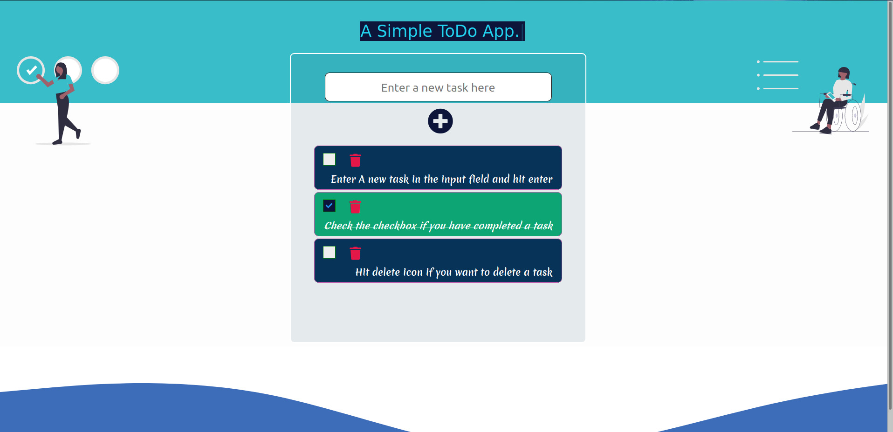
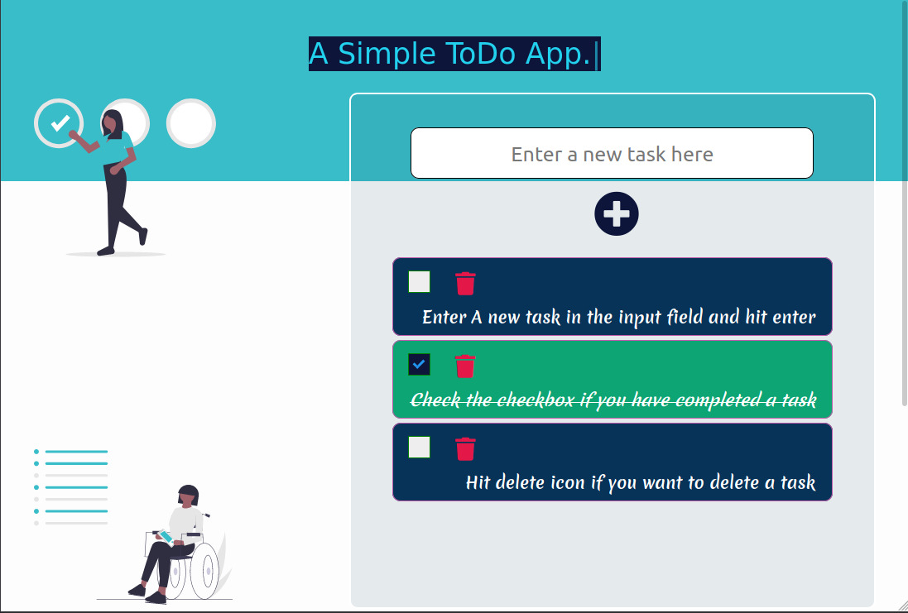
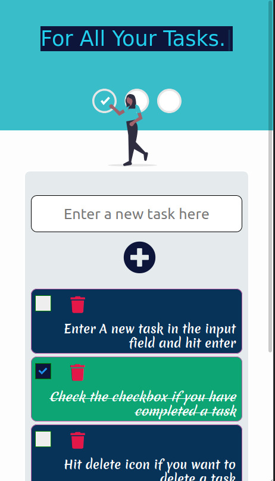

# To-Do Web-App
A simple to-do app created using react

### Sandbox Link: https://codesandbox.io/s/react-todo-app-ue5tu?file=/src/index.js

### How to Use:
1. Enter any task inside the input field and hit enter key or press the '+' button below the input field
2. Check the checkbox when task is completed
3. TO delete a task, hit the delete icon next to checkbox

### Screenshots of web App

                                                Desktop view ( width > 1180px )

                                                 Tablet view ( 1180px > width > 930px )

                                                Mobile view ( 930px > width > 0px )
 

